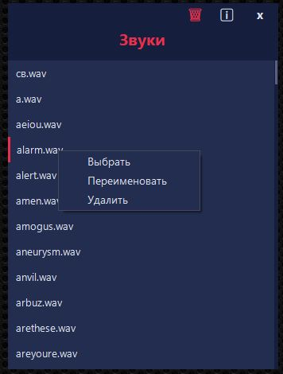
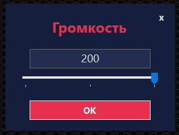

[RU](#beepbot-c--fork-russian-version)

Based on [beepbot](https://github.com/mavis112/beepbot) by `@mavis112`

---

# beepbot (C# Fork)

A ground-up C# rewrite of the original Go-based beepbot. This is a lightweight, interactive Twitch sound bot that runs as a **system tray application** with a full GUI. It lets your chat trigger custom sound memes, generate text-to-speech (TTS) voices in multiple languages, and apply audio effects — all controlled from the system tray or global hotkeys.

> **Original:** Go console app → **This fork:** C# / .NET 8 / Windows Forms tray app

### What's new vs the original beepbot

| Feature | Description |
|---------|-------------|
| **System Tray GUI** | Runs as a tray icon with full context menu — no console window |
| **Sound Browser** | Browse, preview, drag-and-drop import, rename, and delete sounds directly from the GUI |
| **Dark-themed UI** | All forms use a consistent deep blue/red dark theme |
| **Volume Slider** | Custom volume form with slider + text input (0–200%) |
| **Audio Device Selection** | Pick a specific WASAPI output device from a list |
| **Auto-Translate Users** | Ctrl+T translates a user's last message and auto-translates all future messages from them to TTS |
| **Global Hotkeys** | `Ctrl+T` (translate), `Ctrl+M` (mute), `Alt+M` (skip), `Ctrl+Alt+M` (stop) |
| **Connection Sounds** | Configurable connect/leave/error sounds with TTS command templates (`{CHANNEL}` placeholder) |
| **Persistent Config** | All settings (channel, volume, device, translate lang) are saved to `config.env` on change |
| **Anonymous IRC** | Connects to Twitch anonymously via TLS — no OAuth token needed |


---

## Screenshots

### Login window
Opens automatically on first launch.
1. Middle-click (Mouse3) the tray icon
2. Right-click the tray icon → **Status: u_kool** (left-click)
3. Right-click the tray icon → **Settings** → **Change nick...**

Enter your Twitch channel name and click Connect.


### Context Menu
Right-click the tray icon to access all commands: Settings, Sounds, Mute/Unmute, Skip, Stop, and Exit.


### Sound Browser
1. Left-click the tray icon
2. Right-click the tray icon → **Settings** → **Open sounds folder**

Browse, preview, import (drag-and-drop), rename, and delete sound files.



### Volume Control
Open via tray menu **Sounds → Open volume control**. Adjust master volume with a slider (0–200%) or type a value manually. Press Enter or close to save.



---

## Setup & Launch

1. Open `config.env` with a text editor, enter your Twitch channel name (`CHANNEL=your_channel_name`), and optionally set your starting volume (`VOLUME=100`, range 0–200).
2. Place your sound files in **`.wav`** or **`.mp3`** format (44100 Hz recommended) into the `sounds` folder. The filename (excluding the extension) automatically becomes the chat command.
3. Run `beepbot.exe`. A purple "b" icon will appear in the system tray.
4. When updating, replace `beepbot.exe` only. Do not overwrite your `config.env` or `sounds` folder.

> * **File Duration:** Use short sounds (1–10s). The bot caches all audio into RAM for instant playback. Long music tracks will overload your RAM.
> * The `sounds` folder includes a sample `beep.wav` file. Test it with `!m beep` in chat.

---

## Configuration (`config.env`)

| Key | Default | Description |
|-----|---------|-------------|
| `CHANNEL` | *(empty)* | Twitch channel to join (without `#`) |
| `VOLUME` | `100` | Master volume (0–200) |
| `DEVICE_ID` | *(empty)* | WASAPI output device ID (empty = system default) |
| `TRANSLATE_LANG` | `ru` | Target language for auto-translate |
| `SOUND_CONNECT` | `connect.wav` | Sound played when opening settings |
| `SOUND_CONNECTED` | `!m ru-sp150-st success ru-lq-sp150-st коннект ru-sp150-dl {CHANNEL}` | Command executed on successful connection (supports `{CHANNEL}` template) |
| `SOUND_LEAVE` | `leave.wav` | Sound played on exit/close |
| `SOUND_ERROR` | `nepravilno.wav` | Sound played on connection error |

---

## Chat Commands

The main command for viewers is:
`!m [sound_name_or_language_code]-[effects]`

* `!m rand` — play a random sound from the `sounds` folder.

### 1. Text-To-Speech (TTS)
Specify the language code before the text you want to read:
* `!m en hello chat` — read the text in English.
* `!m jp ohayo` — read the text in Japanese.

[Full list of supported languages](tts/Languages.cs)

### 2. Combining Sounds & Speech
* **Simultaneous Mix (using `+`):** `!m sound1+sound2-rs` (both sounds play at the exact same time, reversed).
* **Sequential Chain (using spaces):** `!m sound1-sp150 en hello sound2` (plays sped-up sound1, then reads "hello" in English, then plays sound2).

### 3. Translation
* `!m en-tr hello my friend` — translate English text to Russian and speak it with the Russian voice.

---

## Audio Effects

Viewers can modify any sound or TTS by adding parameters separated by a hyphen `-` (order does not matter):

| Parameter | Effect | Range | Description |
|-----------|--------|-------|-------------|
| `sp[value]` | Speed | 10–200 | Playback speed and pitch (Default: `100`. `sp150` is faster, `sp50` slower). |
| `cs[value]` | Cut start | 0–100 | Cuts the specified percentage from the start (e.g., `cs20`). |
| `ce[value]` | Cut end | 0–100 | Cuts the specified percentage from the end (e.g., `ce20`). |
| `rs` | Reverse | — | Plays the sound backward. |
| `lq` | Low Quality | — | 8-bit retro sound effect (bitcrushing). |
| `st` | Stutter | — | Rapid stutter effect at the beginning. |
| `er` | Ear Rape | — | Extreme volume overdrive. |
| `dl` | Delay | — | Decaying echo effect. |
| `vb` | Vibrato | — | Pitch-vibrating effect. |
| `ga` | Gacha | — | Randomly adds unused effects. Added count depends on how many you already specified (3+ = nothing, unless 5% jackpot). |
| `tr` | Translation | — | **TTS only.** Translates text to the target language. |

*(Examples: `!m ru-sp150 hello`, `!m omg-ga`)*

> *Note:* Trimming (cs/ce) is always applied first, before any other effects.

> **TTS Length Limit (200 chars):** The free Google TTS API has a 200-character limit. Chain multiple TTS commands to bypass:
> * ❌ `!m ru long_text_300_chars` (truncated to 200 chars).
> * ✅ `!m ru text_150_chars ru text_150_chars` (plays seamlessly).

---

## Admin Commands (Broadcaster & Moderators Only)

| Command | Description |
|---------|-------------|
| `!m mute` / `unmute` | Mutes / unmutes the bot (stops audio, clears queue). |
| `!m qon` / `qoff` | Enables / disables sequential queue (if `qoff`, sounds overlap concurrently). |
| `!m eron` / `eroff` | Enables / disables global ear safety (blocks `er` effect). |
| `!m stop` | Instantly stops playback and clears the queue. |
| `!m skip` | Interrupts current sound and plays the next queued item. |
| `!m vol [value]` | Sets master volume (0–200, default: 100). Auto-saved. |

---

## Building from Source

Requirements: .NET 8 SDK

```
dotnet publish -c Release -r win-x64 --self-contained -p:PublishSingleFile=true
```

Or use the included `publish.bat` script.

---

## Tech Stack

- **C# / .NET 8** with Windows Forms
- **NAudio** v2.3.0 — audio playback, resampling, WASAPI output, WAV/MP3 decoding
- **DotNetEnv** v3.1.1 — `config.env` reader/writer
- **Anonymous Twitch IRC** — custom TLS client, no OAuth required

---

<a name="beepbot-c--fork-russian-version"></a>

# beepbot (C# Форк)

Полный переписанный на C# форк оригинального Go-бота beepbot. Это лёгкий интерактивный Twitch-бот, работающий как **приложение в области уведомлений** с полноценным GUI. Позволяет зрителям запускать звуковые мемы, озвучивать текст (TTS) на разных языках и накладывать аудиоэффекты — всё управление через трей или глобальные горячие клавиши.

> **Оригинал:** Go консольное приложение → **Этот форк:** C# / .NET 8 / Windows Forms трей-приложение

### Что нового по сравнению с оригиналом

| Возможность | Описание |
|-------------|----------|
| **Трей-интерфейс** | Работает как значок в трее с полным контекстным меню — без консольного окна |
| **Браузер звуков** | Просмотр, превью, drag-and-drop импорт, переименование и удаление звуков из GUI |
| **Тёмная тема** | Все формы используют единую тёмную тему (синий/красный акцент) |
| **Ползунок громкости** | Форма громкости с ползунком + текстовым вводом (0–200%) |
| **Выбор аудиоустройства** | Выбор конкретного WASAPI устройства вывода |
| **Авто-перевод пользователей** | Ctrl+T переводит последнее сообщение пользователя и автоматически переводит все будущие сообщения |
| **Глобальные горячие клавиши** | `Ctrl+T` (перевод), `Ctrl+M` (mute), `Alt+M` (skip), `Ctrl+Alt+M` (stop) |
| **Звуки подключения** | Настраиваемые звуки подключения/выхода/ошибки с шаблонами TTS (`{CHANNEL}`) |
| **Сохранение настроек** | Все параметры (канал, громкость, устройство, язык) сохраняются в `config.env` при изменении |
| **Анонимный IRC** | Подключение к Twitch анонимно через TLS — токен OAuth не нужен |


---

## Скриншоты

### Окно логина
Открывается автоматически при первом запуске.
1. По клику колёсиком мыши (Mouse3) на значке в трее
2. Через контекстное меню (ПКМ) → **Status: u_kool** (ЛКМ)
3. Через контекстное меню (ПКМ) → **Настройки** → **Сменить ник...**

Введите имя вашего Twitch-канала и нажмите Connect.


### Контекстное меню
Правый клик по иконке в трее — доступ ко всем командам: Settings, Sounds, Mute/Unmute, Skip, Stop и Exit.


### Браузер звуков
1. Открывается по клику ЛКМ на значке в трее
2. Через контекстное меню (ПКМ) → **Настройки** → **Открыть папку sounds**

Просмотр, превью, импорт (drag-and-drop), переименование и удаление звуков.


### Регулятор громкости
Открывается через трей-меню **Sounds → Open volume control**. Ползунок (0–200%) или ручной ввод значения. Нажмите Enter или закройте окно для сохранения.


---

## Настройка и запуск

1. Откройте `config.env` текстовым редактором, впишите имя вашего Twitch-канала (`CHANNEL=имя_вашего_канала`) и, по желанию, стартовую громкость (`VOLUME=100`, диапазон 0–200).
2. Положите аудиофайлы в формате **`.wav`** или **`.mp3`** (рекомендуется 44100 Гц) в папку `sounds`. Название файла (без расширения) становится командой вызова.
3. Запустите `beepbot.exe`. В области уведомлений появится значок с буквой "b".
4. При обновлении заменяйте только `beepbot.exe`. Не перезаписывайте `config.env` и папку `sounds`.

> * **Длительность звуков:** Используйте короткие звуки (1–10 сек). Бот кеширует аудио в ОЗУ для мгновенного воспроизведения.
> * В папке `sounds` уже есть тестовый `beep.wav`. Проверьте командой `!m beep` в чате.

---

## Конфигурация (`config.env`)

| Ключ | По умолчанию | Описание |
|------|-------------|----------|
| `CHANNEL` | *(пусто)* | Имя Twitch-канала (без `#`) |
| `VOLUME` | `100` | Громкость (0–200) |
| `DEVICE_ID` | *(пусто)* | ID WASAPI устройства вывода (пусто = системное по умолчанию) |
| `TRANSLATE_LANG` | `ru` | Целевой язык для авто-перевода |
| `SOUND_CONNECT` | `connect.wav` | Звук при открытии настроек |
| `SOUND_CONNECTED` | `!m ru-sp150-st success ru-lq-sp150-st коннект ru-sp150-dl {CHANNEL}` | Команда, выполняемая при успешном подключении (поддерживает `{CHANNEL}`) |
| `SOUND_LEAVE` | `leave.wav` | Звук при выходе/закрытии |
| `SOUND_ERROR` | `nepravilno.wav` | Звук при ошибке подключения |

---

## Синтаксис команд в чате

Основная команда для зрителей:
`!m [имя_звука_или_код_языка]-[эффекты]`

* `!m rand` — проиграть случайный звук из папки `sounds`.

### 1. Озвучка текста (TTS)
Укажите код языка перед текстом:
* `!m ru привет чат` — озвучить текст на русском.
* `!m jp аниме` — озвучить текст на японском.

[Полный список поддерживаемых языков](tts/Languages.cs)

### 2. Комбинирование (Миксы и Цепочки)
* **Микс (одновременно через `+`):** `!m sound1+sound2-rs` (звуки запустятся одновременно, оба реверсом).
* **Цепочка (последовательно через пробел):** `!m sound1-sp150 ru привет sound2` (ускоренный sound1 → «привет» по-русски → sound2).

### 3. Перевод
* `!m en-tr hello my friend` — перевести английский текст на русский и озвучить русским голосом.

---

## Доступные аудиоэффекты

Эффекты добавляются через дефис `-` после имени звука или кода языка (порядок не важен):

| Параметр | Эффект | Диапазон | Описание |
|----------|--------|----------|----------|
| `sp[число]` | Скорость | 10–200 | Скорость и высота (норма: `100`. `sp150` — быстрее, `sp50` — медленнее). |
| `cs[число]` | Срез начала | 0–100 | Отрезать процент звука с начала (например, `cs20`). |
| `ce[число]` | Срез конца | 0–100 | Отрезать процент звука с конца (например, `ce20`). |
| `rs` | Реверс | — | Воспроизвести задом наперёд. |
| `lq` | Лоу-фай | — | 8-битный ретро-эффект (биткрашинг). |
| `st` | Заикание | — | Быстрое заикание в начале звука. |
| `er` | Перегруз | — | Экстремальный перегруз громкости. |
| `dl` | Эхо | — | Плавное затухающее эхо. |
| `vb` | Вибрация | — | Дрожание частоты (Vibrato). |
| `ga` | Гача | — | Случайно добавляет неиспользованные эффекты (5% шанс джекпота при 3+ эффектах). |
| `tr` | Перевод | — | **Только для TTS.** Переводит текст на указанный язык. |

*(Примеры: `!m ru-sp150 привет`, `!m omg-ga`)*

> *Примечание:* Обрезка (cs/ce) применяется первой, до остальных эффектов.

> **Лимит TTS (200 симв.):** Из-за бесплатного API лимит — 200 символов. Обходите цепочкой команд:
> * ❌ `!m ru длинный_текст_300_символов` (обрежется до 200).
> * ✅ `!m ru текст_150_символов ru текст_150_символов` (проиграется без швов).

---

## Команды модерирования (Стример и Модераторы)

| Команда | Описание |
|---------|----------|
| `!m mute` / `unmute` | Заглушить / включить бота. |
| `!m qon` / `qoff` | Включить / выключить очередь. |
| `!m eron` / `eroff` | Включить / выключить безопасность ушей. |
| `!m stop` | Мгновенно выключить и очистить очередь. |
| `!m skip` | Прервать текущий звук, запустить следующий. |
| `!m vol [число]` | Громкость (0–200). Автосохранение. |

---

## Сборка из исходников

Требования: .NET 8 SDK

```
dotnet publish -c Release -r win-x64 --self-contained -p:PublishSingleFile=true
```

Или используйте скрипт `publish.bat`.

---

## Технологии

- **C# / .NET 8** с Windows Forms
- **NAudio** v2.3.0 — воспроизведение, ресемплинг, WASAPI, декодирование WAV/MP3
- **DotNetEnv** v3.1.1 — чтение/запись `config.env`
- **Анонимный Twitch IRC** — кастомный TLS-клиент, OAuth не нужен
